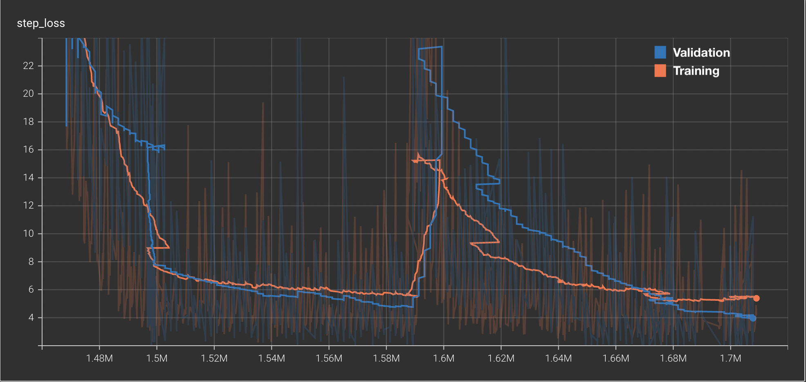

## Persian (فارسی) STT Model
This is a Persian DeepSpeech model that is currently in development. It is licensed under [GNU GPLv3](LICENSE).

Jump to section:

- [Persian (فارسی) STT Model](#persian-فارسی-stt-model)
- [Data Preprocessing](#data-preprocessing)
  - [Common-Voice](#common-voice)
  - [Text Corpus](#text-corpus)
- [Training](#training)
- [Initial Configuration](#initial-configuration)
- [Release](#release)
- [Model card for Persian STT v0.1.0](#model-card-for-persian-stt-v010)
  - [Model details](#model-details)
  - [Intended use](#intended-use)
  - [Performance Factors](#performance-factors)
  - [Metrics](#metrics)
    - [Transcription Accuracy](#transcription-accuracy)
    - [Real-Time Factor](#real-time-factor)
    - [Model Size](#model-size)
    - [Approaches to uncertainty and variability](#approaches-to-uncertainty-and-variability)
  - [Training data](#training-data)
  - [Evaluation data](#evaluation-data)
  - [Ethical considerations](#ethical-considerations)
  - [Demographic Bias](#demographic-bias)
  - [Surveillance](#surveillance)
  - [Caveats and recommendations](#caveats-and-recommendations)
## Data Preprocessing
### Common-Voice
- [persian_stt.ipynb](persian_stt.ipynb) contains a notebook that demonstrates how to preprocess the data.
- The Common-Voice dataset was obtained from [here](https://commonvoice.mozilla.org/en/datasets).
- Using STT's [bin/import_cv2.py](https://github.com/coqui-ai/STT/blob/main/bin/import_cv2.py) script, the data was matched to the alphabet converted to CSV files.
- The generated `validated.csv` was passed to `auto_input_dataset=metadata` in the configuation step.
### Text Corpus
- The raw text corpus was obtained from [here](https://github.com/persiannlp/persian-raw-text).
- Then, the corpus was normalized, tokenized, and cleaned using the `persianify` function and `_HTMLStripper` in the notebook.
## Training
- The model was trained 2 separate times with `force_initialize_learning_rate`.
`learning_rate` was increased for the second run from 0.00012 to 0.0004.

- Training was stopped at 1896648 steps after optimizing the model.

## Initial Configuration
- Tranfer learning from the STT English model was enabled (with `drop_source_layers=2`)
- The model was trained with the following configuration:
```python
initialize_globals_from_args(
    scorer_path='/content/kenlm-persian.scorer',
    dropout_rate=0.175,
    learning_rate=0.000095,
    force_initialize_learning_rate=True,
    train_cudnn=True,
    reduce_lr_on_plateau=True,
    plateau_epochs=3,
    plateau_reduction=0.2,
    auto_input_dataset=metadata,
    checkpoint_dir=checkpoint_dir,
    export_dir=export_dir,
    epochs=200,
    train_batch_size=128,
    dev_batch_size=128,
    test_batch_size=384,
)
```
- Then, the dropout rate was decreased as the learning rate was decreasing due to the plateau to reach the minimum loss values.
- Final test: `WER: 0.108172, CER: 0.025068, loss: 1.292882`
- It is worth noting that many of the errors are due to the language syntax. For example, the model is unable to distinguish between the following words by themselves:<br>
`امیررضا` and `امیر رضا`
`آهودخت` and `آهو دخت`
`امیرآرشام` and `امیر آرشام`.
- Thankfully, the scorer is able to handle most of these cases, according to the context.

## Release
 - The acoustic and language models are available in [releases](https://github.com/Oct4Pie/persian-stt/releases)

## Model card for Persian STT v0.1.0
### Model details

- Person or organization developing model: Maintained by [oct4pie](https://github.com/Oct4Pie).
- Model language: Persian / Farsi / `fa`, `fa-IR`
- Model date: June 21, 2022
- Model type: `Speech-to-Text`
- Model version: `v0.1.0`
- Compatible with 🐸 STT version: `v1.3.0`
- License: GNU Lesser General Public License v3.0
- Citation details: `@techreport{persian-stt, author = {Mehdi Hajmollaahmad Naraghi}, title = {Persian STT v0.1.0}, institution = {Coqui}, address = {\url{https://coqui.ai/models}} year = {2022}, month = {June}, number = {STT-FA-0.1.0} }`
- Where to send questions or comments about the model: You can leave an issue on [`STT` issues](https://github.com/coqui-ai/STT/issues), open a new discussion on [`STT` discussions](https://github.com/coqui-ai/STT/discussions), or chat with us on [Gitter](https://gitter.im/coqui-ai/).

### Intended use

Speech-to-Text for the [Persian Language](https://en.wikipedia.org/wiki/Persian_language) on 16kHz, mono-channel audio.

### Performance Factors

Factors relevant to Speech-to-Text performance include but are not limited to speaker demographics, recording quality, and background noise. Read more about STT performance factors [here](https://stt.readthedocs.io/en/latest/DEPLOYMENT.html#how-will-a-model-perform-on-my-data).

### Metrics

STT models are usually evaluated in terms of their transcription accuracy, deployment Real-Time Factor, and model size on disk.

#### Transcription Accuracy

Using the language model with settings `lm_alpha=0.36669178512950323` and `lm_beta=0.3457913671678824` (found via `lm_optimizer.py`):

- Common-Voice clean: WER: 10.81\%, CER: 2.506\%

#### Real-Time Factor

Real-Time Factor (RTF) is defined as `proccesing-time / length-of-audio`. The exact real-time factor of an STT model will depend on the hardware setup, so you may experience a different RTF.

Recorded average RTF on laptop CPU: `.72`


#### Model Size

For STT, you always must deploy an acoustic model, and it is often the case you also will want to deploy an application-specific language model.

| Model type              | Filename               | Size   |
| ----------------------- | ---------------------- | ------ |
| Acoustic model (tflite) | `persian_stt.tflite`   | 45.3M  |
| Acoustic model (pb)     | `persian_stt.pb`       | 181M   |
| Acoustic model (pbmm)   | `persian_stt.pbmm`     | 181M   |
| Language model          | `kenlm-persian.scorer` | 1.63GB |

#### Approaches to uncertainty and variability

Confidence scores and multiple paths from the decoding beam can be used to measure model uncertainty and provide multiple, variable transcripts for any processed audio.

### Training data

This model was trained on the following corpora: Common Voice 9.0 Persian (cleaned and with custom train/dev/test splits). In total approximately ~271 hours of data.

### Evaluation data

The validation ("dev") sets were cleaned and generated from Common Voice 9.0 Persian.

### Ethical considerations

Deploying a Speech-to-Text model into any production setting has ethical implications. You should consider these implications before use.

### Demographic Bias

You should assume every machine learning model has demographic bias unless proven otherwise. For STT models, it is often the case that transcription accuracy is better for men than it is for women. If you are using this model in production, you should acknowledge this as a potential issue.

### Surveillance

Speech-to-Text may be mis-used to invade the privacy of others by recording and mining information from private conversations. This kind of individual privacy is protected by law in may countries. You should not assume consent to record and analyze private speech.

### Caveats and recommendations

Machine learning models (like this STT model) perform best on data that is similar to the data on which they were trained. Read about what to expect from an STT model with regard to your data [here](https://stt.readthedocs.io/en/latest/DEPLOYMENT.html#how-will-a-model-perform-on-my-data). 

In most applications, it is recommended that you [train your own language model](https://stt.readthedocs.io/en/latest/LANGUAGE_MODEL.html) to improve transcription accuracy on your speech data.